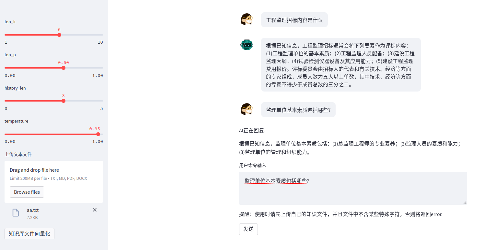

# learningAids
学习LLM项目：通过上传知识库搭建知识小助手。
## 简介

基于ChatGLM-6b+streamlit搭建的知识小助手，通过上传知识库，可以快速查找知识点。

* 知识助手
## 示例

## LICENSE
 本作品采用<a rel="license" href="http://creativecommons.org/licenses/by-nc-sa/4.0/">知识共享署名-非商业性使用-相同方式共享 4.0 国际许可协议</a>进行许可。
